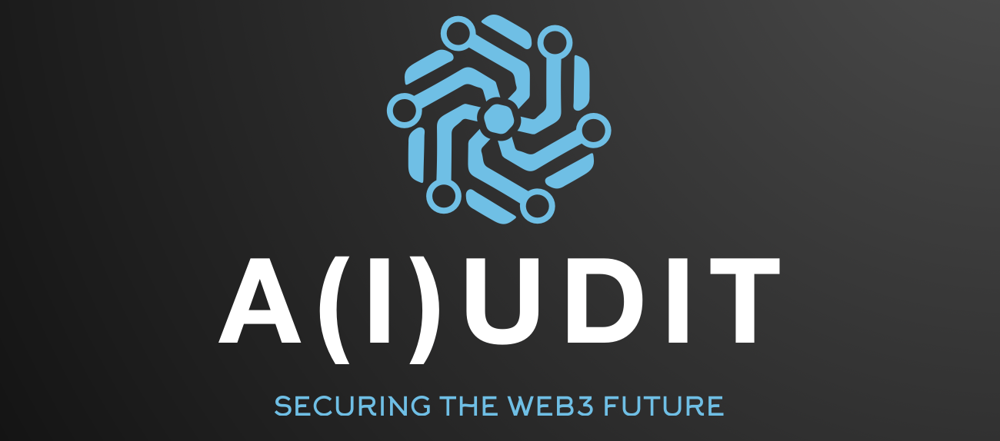

# :lock: A(i)udit
A(i)udit is the first open-source, security-first development platform that empowers both auditors & developers to more effectively secure the future of web3 by combining auditing tools with LLMs and AI Agents. 

Use natural language to author, audit, and deploy - all from a single platform.

# Description

## Background

# How its made

