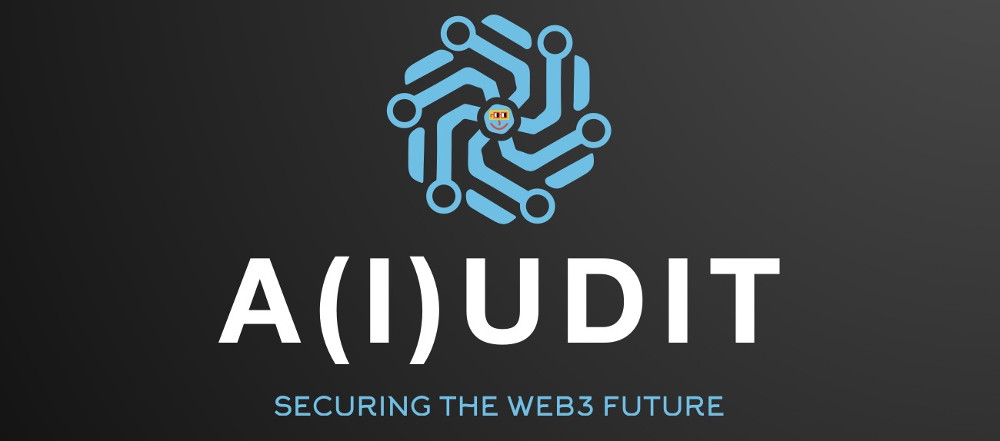

# :lock: A(i)udit (TL;DR)
A(i)udit is an open-source tool that gracefully adds security best practices _earlier in the developer loop_ to help write safer, more secure smart contracts. A(i)udit uses LLMs and AI Agents to lower the barrier for utility and implementation of auditing tools to capture more vulnerabilities and bugs far earlier in the development process, reducing the time it takes to eventually audit and increasing the baseline code quality for a brighter, more secure web3 future.

Engineers can use natural language to author, audit, and deploy - all from a single platform.

# :runner: Motivation (Why?)
In 2022 alone, over $3.6 billion USD was lost due to exploits & hacks from 167 major security incidents - with a *whopping 51.5% of these being from audited protocols!* ([Global Web3 Security Report 2022 by the Blockchain Security Alliance](https://beosin.com/resources/Global_Web3_Security_Report_2022_.pdf)). We do not dispute the value of audits, but they are centralized, expensive (both time & monetary), and are not enforced - the security of our web3 future cannot rely on audits alone.

__And so, how do we make it easier for developers be part of the solution & incorporate a security-first practices earlier in their developer loop?__

Our answer is A(i)udit: an all-in-one platform where engineers use natural language to author, audit, test, and deploy smart contracts to any chain & with any test. 
* For developers, A(i)udit "shifts-left" security best practices by enabling security-specific testing and rapid prototyping to take place much earlier in the development lifecycle. **Get ramped up & familiar with security and auditing tools in your dev loop _before_ commissioning a (costly) audit.**
* For junior auditors, A(i)udit lets you focus on finding vulnerabilities by removing the overhead of learning & managing multiple tools, programs, environments, audit report templates, and frameworks. **Hit the ground running faster & more effectively with A(i)udit.**

# :blue_book: Description (What?)
Specifically, A(i)udit is a tool that developers can use to execute blockchain-specific workflows using natural language. We chose to focus specifically on security & auditing for the Hackathon. Below is a description of a sample workflow:
1. The user uploads their own smart contract to the platform. Alternatively, a developer can use A(i)udit to help them get started on a smart contract too. _We currently only support EVM compatible smart contracts._
2. The user can then simply ask A(i)udit to write and execute simple unit and fuzz tests. _We cannot gaurantee or vouch for the quality of the unit tests and currently only support Foundry Fuzz tests._
3. The user can ask A(i)udit to execute static analysis tests. _Currently we support Static Analysis tests using Mythril & Slither._
4. The user can ask the model to store the test results to IPFS using `web3.storage` for streamlined review, triage, and collaboration to address identified vulnerabilities.
5. The user repeats steps 1-4 until no vulnerabilities are detected.
6. The user can then ask A(i)udit to deploy the smart contract to a testnet or mainnet. _We currently only support Ethereum, Gnosis, Polygon, and a local Ethereum node as destinations._

# :nut_and_bolt: How A(i)udit was born
A(i)udit was made using the open-source [LangChain framework](https://github.com/hwchase17/langchain), which gives LLMs like ChatGPT the ability to successfully execute tasks of varying complexity. We currently support ChatGPT 3.5 but we hope to enable an end-user to use _any_ LLM they wish (ideally open-source ones).

##### Core components and infrastructure
* Large Language Model (LLM): [OpenAI's ChatGPT 3.5](https://openai.com/chatgpt)
* AI Agent: [LangChain Action Agents](https://langchain-langchain.vercel.app/docs/modules/agents/#action-agents)
* Auditing tools: [Mythril](https://github.com/ConsenSys/mythril), [Foundry](https://github.com/foundry-rs/foundry), and [Slither](https://github.com/crytic/slither).
* [Poetry](https://python-poetry.org): A simple python package and dependency management system

##### Agent Tools
* `mythril_tool`: Used for running static analyses on smart contracts. Returns the path to the results (a `.txt` file) that will be stored on IPFS.
* `slither_test_analysis`: Used for performing static analyses on EVM-compatible smart contracts.
* `smart_contract_compiler`: Useful for compiling EVM-compatible smart contracts. Returns the path to a file containing the bytecode.
* `smart_contract_identifier`: Used for identifying a contract on an EVM blockchain. Given an address, this tool returns whether it is a contract or not. If it is a proxy, returns its implementation address.
* `smart_contract_tester`: Used for writing EVM-compatible smart contracts test cases. Returns the path to the `.js` file containing the test.
* `smart_contract_writer`: Used for writing EVM-compatible smart contracts given a title and description. Returns the path to the `.sol` file.
* `smart_contract_deployer`: Useful for deploying EVM-compatible smart contracts given a path to a file containing the bytecode and the network to deploy to. Returns the address of the deployed contract.
* `smart_contract_fuzzytester`: Useful for writing EVM-compatible smart contracts fuzz testing use cases. Returns the path to the `.sol` file.
* `view_test_tool_result`: This stores the only files extension `.txt` to filecoin and returns an id that can be used to review the audit results. Useful for reviewing txt files generated by audit tools.

Our roadmap is ambitious, we plan to invest in:
1.  Additional tools for the AI agents, with a specific focus on expanding support for a wider range of tests and audit use cases.
2.  A frontend and IDE for a more interactive and tigher developer loop.
3.  Support for open-source models to make A(i)udit a _true_ public good.
4.  Extending the product offering to support specific workflows unique to auditors, and perhaps even web2 use cases.

# Usage
## Installation
poetry install

npm i @openzeppelin/contracts@4.8.3

poetry run python -c "import solcx; solcx.install_solc('0.8.19')"

poetry shell

aiudittool

# When running the slither test, we needs to setup the following in the virtula env
$ solc-select install <version> 
$ solc-select versions
$ solc-select use 0.8.19
## Usage

# need to add slither-analyzer dependency
